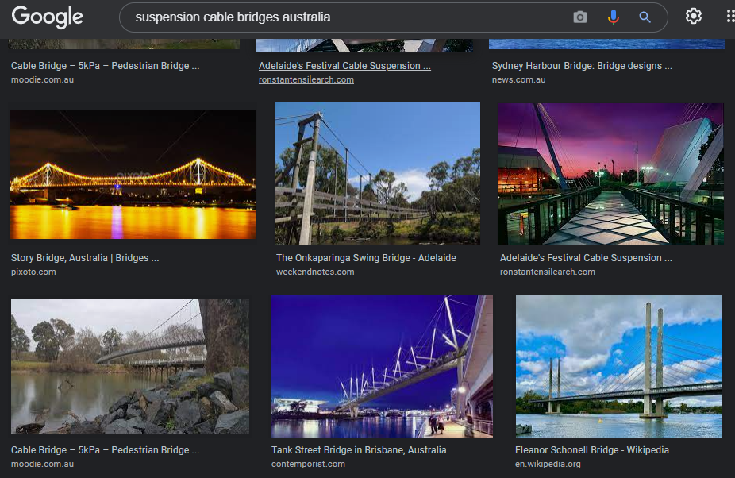

# DUCTF 2021 - Get over it!

  
  


## Description
Author: QUTWH

Bridget loves bridges, this one is her favourite.

What is the name of it and the length of its main span to the nearest metre?


## Solution

Since an image is provided for this challenge. I first attempted a reverse image search , but unfortunately no results where found . The next pattern I searched for was a suspension cable bridge in australia, as the challenge image showcased that it was suspension cable bridge and the competition was held in australia. 

Scrolling through the images , I stumbled across an image that looks very similar to the one provided and found that it was Elearnor Schonell Bridge. 



For the next part of the flag I googled " main span length of Eleanor Schonell Bridge" which gave the results of 185 meters.
  
## Flag
  
Combining the two parts we now have the flag  
``` DUCTF{Eleanor_Schonell_Bridge-185m} ```
